<h2 align="left">Hi 👋, I'm Anik Das</h2>

<h4 align="left">
  🔧 Currently working as Linux Kernel Developer @ Qualcomm
   
  🌐 Know more about me at
  <a href="https://anikdas.netlify.app/">anikdas.netlify.app</a>
</h4>

###

 

  

###

 

  

  

###

 

  

###
